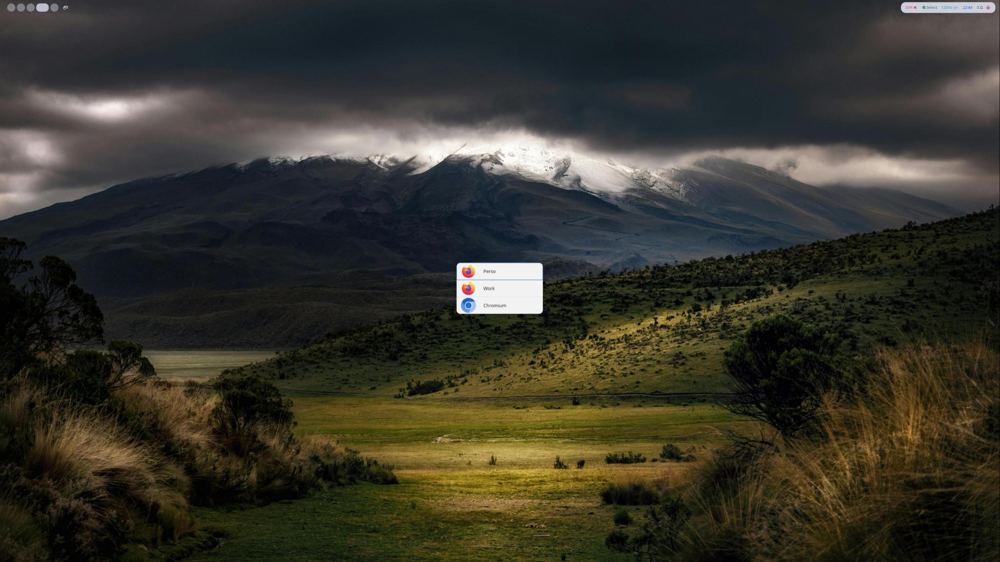

## Installation

<p align="center">
    
</p>

### From sources

1. Install dependencies

   - libgtk-4-dev
   - libdbus-1-dev

2. Install rust: https://www.rust-lang.org/tools/install
3. Compile and install the app:

```sh
cargo install --path .
```

4. Add `~/.cargo/bin/` to your PATH

## First run

1. Create a config file (see [Config](#config))
2. Copy the choosme desktop file:

```sh
cp ./choosme.desktop ~/.local/share/applications/
```

3. Set choosme as your default browser:

```sh
xdg-settings set default-web-browser choosme.desktop
```

## Shortcuts

- `Escape` to close
- `1` open the first row
- `2` open the 2nd row
- etc

## Config

`~/.config/choosme/config.toml`

```toml
# this app is never auto selected
[[application]]
path = "/usr/share/applications/firefox.desktop"
alias = "Perso" # this will be the row title instead of the .desktop Name

# it auto selects the work firefox if URL starts with http://work.atlassian.com/
[[application]]
path = ".local/share/applications/firefox-work.desktop"
alias = "Work" # this will be the row title instead of the .desktop Name
prefixes = [
    "http://work.atlassian.com/"
]

# it auto selects chrome if
# - the URL starts with https://gmail.com
# - or we click on a google maps link
[[application]]
path = "/usr/share/applications/chromium.desktop"
alias = "Chromium" # this will be the row title instead of the .desktop Name
prefixes = [
    "https://gmail.com"
]
regexps = [
    "^https?://(www.)?google.(?:com|fr)/maps.*"
]

# if you click to any link that is not gmail.com, it'll open choosme UI.
# you then have to choose between Firefox (Perso and Work) and Chromium to open this link.
```

## Styling

On first run, if the CSS file does not exist, Choosme will create a new default one.
The styling creating a CSS file here: `~/.config/choosme/style.css`.

```css
/* application (item) */
.application {
  padding: 0.5rem;
  border-radius: 0;
}

/* first application */
.application.first {
  border-radius: 1rem 1rem 0 0;
}

/* last application */
.application.last {
  border-radius: 0 0 1rem 1rem;
}

/* row between list and application */
.list > * {
  padding: 0;
}

/* main list */
.list {
  border-radius: 1rem 1rem;
  background-color: transparent;
}

/* main window */
.main-window {
  background-color: transparent;
}
```

## Daemon mode

If you want to have a faster and/or having control over your fallback browser for your session, you can use the daemon mode.
Then you are still using the app as usual. Choosme will try to connect to the daemon, and if it fails run as a |standalone application.

Example for sway:

```
exec {
    choosme daemon
}
```

## Nice to have

- [ ] Auto set as default web browser on first run
- [ ] Auto detect browsers to init config file
- [ ] Be able to add or remove apps from the UI
- [ ] From the UI, have a drop down menu (hidden by default) where are presented the full URL (you can modify the URL to edit it) and the dns only, click on one of both, then you choose your app, it will be registred as your default app for this prefix
- [ ] Open window near cursor in Sway
- [ ] Enter opens the last used browser
- [ ] Change configuration logic to be

```toml
[[rule]]
prefix="http://github.com/fabienjuif"
application="Firefox"

# this rule apply only if the first one is not matching
[[rule]]
prefix="http://google.com"
application="Chrome"

# optional fallback rule if you want to avoid the UI to pop
[[rule]]
default="Firefox"

[[application]]
path=
name="Firefox"

[[application]]
path=
name="Chrome"
```
